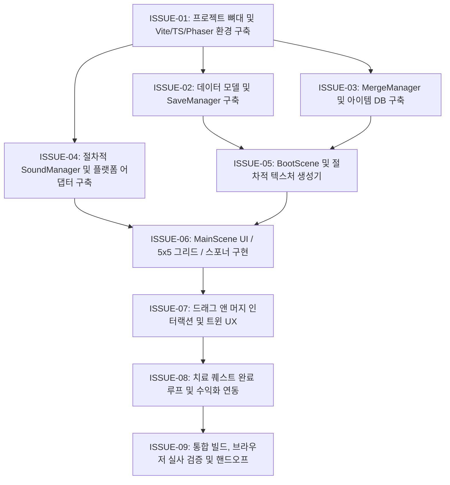

# [ISSUES] 유기동물 쉼터 복원 머지 개발 태스크 명세서

- **문서 버전**: v1.0.0 (Decision Complete)
- **작성일자**: 2026-09-29
- **책임자**: Kodari_Dev_Manager (코다리 부장)
- **승인자**: 대표님

---

## 📌 이슈 마일스톤 개요

---

## 🛠️ 세부 태스크 명세

### ISSUE-01: 프로젝트 뼈대 및 기본 환경 구축 (Project Scaffolding)
- **목표**: Vite + TypeScript + Phaser 3 빌드 파이프라인 완성.
- **대상 파일**:
  - `package.json`
  - `tsconfig.json`
  - `vite.config.ts`
  - `index.html`
  - `src/main.ts`
- **작업 상세**:
  1. `phaser` (^3.80.0), `typescript`, `vite` 의존성 정의.
  2. 세로 뷰포트(480x854)를 중앙 정렬하는 HTML/CSS 메타 태그 구성.
  3. Phaser Game 인스턴스 초기화 (`src/main.ts`).
- **검증 기준**:
  - `npm install` 정상 완료.
  - `npm run build` 에러 없이 `dist/` 빌드 성공.

---

### ISSUE-02: 데이터 모델 및 저장소 관리자 (Types & SaveManager)
- **목표**: 안전한 상태 정의 및 브라우저 세이브/로드 무결성 보장.
- **대상 파일**:
  - `src/types/game.ts`
  - `src/managers/SaveManager.ts`
- **작업 상세**:
  1. `ItemConfig`, `BoardCell`, `PetOrder`, `PlayerData` 인터페이스 선언.
  2. `SaveManager.load()`: `localStorage` 손상 시 자동 fallback 방어 로직.
  3. `SaveManager.save()`: 상태 변경 즉시 동기화.
  4. 오프라인 에너지 누적 계산 로직 (`lastEnergyRegenTime` 기반).
- **검증 기준**:
  - 데이터 저장 후 브라우저 새로고침 시 기존 보드 상태 및 재화가 100% 복원되는지 단위 확인.

---

### ISSUE-03: 코어 머지 알고리즘 및 아이템 DB (MergeManager)
- **목표**: 사료/장난감 1~4단계 아이템 데이터베이스 및 합성 판정 로직.
- **대상 파일**:
  - `src/managers/MergeManager.ts`
- **작업 상세**:
  1. `ITEM_DATABASE` 구성 (사료 4종: `food_1`~`food_4`, 장난감 4종: `toy_1`~`toy_4`).
  2. `canMerge(a, b)`: 같은 카테고리, 같은 레벨, 미최고레벨 판정.
  3. `getNextLevelItem(current)`: 차상위 레벨 아이템 반환.
  4. `getRandomSpawnItem()`: 1단계 사료 또는 장난감 50% 확률 반환.
- **검증 기준**:
  - 레벨 4 합성 시도 시 false 반환 확인.
  - 이종 카테고리 간 합성 불가 확인.

---

### ISSUE-04: 절차적 SoundManager 및 플랫폼 어댑터 모듈
- **목표**: 무외부 의존성 Web Audio 합성 사운드 및 플랫폼 추상화 레이어 구현.
- **대상 파일**:
  - `src/audio/SoundManager.ts`
  - `src/adapters/PlatformAdapter.ts`
  - `src/adapters/WebMockAdapter.ts`
- **작업 상세**:
  1. Web Audio API 오실레이터를 이용한 스폰/머지/완료/에러 4대 효과음 구현.
  2. 브라우저 AudioContext 자동재생 정책 대응 (첫 터치 시 자동 활성화).
  3. `PlatformAdapter` 인터페이스 및 웹 데모용 `WebMockAdapter` 구현.
- **검증 기준**:
  - 별도 mp3/wav 파일 없이 브라우저에서 경쾌한 합성 사운드 정상 출력.

---

### ISSUE-05: 부트 씬 및 절차적 텍스처 생성기 (BootScene)
- **목표**: 외부 이미지 없이 Phaser Graphics로 8종 아이템 및 박스 텍스처 실시간 렌더링.
- **대상 파일**:
  - `src/scenes/BootScene.ts`
- **작업 상세**:
  1. 사료 라인(탄/브라운/골드 컬러 계열) 텍스처 동적 생성.
  2. 장난감 라인(스카이블루/로열블루/네이비 컬러 계열) 텍스처 동적 생성.
  3. 스포너 보물상자 및 슬롯 플레이트 텍스처 생성.
  4. 텍스처 생성 완료 후 즉시 `MainScene`으로 전환.
- **검증 기준**:
  - 부트 씬 실행 직후 텍스처 캐시에 9종 이상의 텍스처가 정상 등록되는지 확인.

---

### ISSUE-06: 메인 씬 UI / 5x5 그리드 / 스포너 구현 (MainScene Layout)
- **목표**: 게임 메인 화면 구성 및 상자 스폰 로직 동작.
- **대상 파일**:
  - `src/scenes/MainScene.ts`
- **작업 상세**:
  1. 상단 바: 골드, 하트, 에너지, 쉼터 레벨 텍스트 바인딩.
  2. 쉼터 환자 카드: 현재 치료 대상 유기동물 이름 및 필요 아이템 표시.
  3. 5x5 그리드 배경 슬롯 렌더링.
  4. 스포너 상자 버튼 클릭 시 에너지 -1 차감 및 랜덤 빈 슬롯에 1단계 아이템 생성.
  5. 2분 주기 에너지 자동 충전 타이머 루프 구동.
- **검증 기준**:
  - 스폰 클릭 시 보드에 아이템 등장 및 에너지 차감 확인.
  - 에너지가 0일 때 스폰 차단 확인.

---

### ISSUE-07: 드래그 앤 머지 인터랙션 및 트윈 UX (Drag & Drop UX)
- **목표**: 쫀득한 드래그 손맛과 합성 승급 및 실패 시 복귀 애니메이션.
- **대상 파일**:
  - `src/scenes/MainScene.ts`
- **작업 상세**:
  1. Phaser 드래그 이벤트 (`dragstart`, `drag`, `dragend`) 바인딩.
  2. 타깃 슬롯 위치 계산 및 합성 가능 여부 검사.
  3. 합성 성공 시:
     - 차상위 아이템으로 승급 교체.
     - 팝업 확대/축소 스케일 트윈 애니메이션.
     - 머지 사운드 FX 재생.
  4. 빈 슬롯 이동: 자연스러운 위치 이동.
  5. 드롭 실패(영역 밖, 머지 불가 아이템 위):
     - 원래 위치로 부드러운 Tween 복귀 (200ms ease-out).
     - 에러 사운드 FX 재생.
- **검증 기준**:
  - 드래그 도중 depth 최상위 설정 확인.
  - 실패 시 아이템이 튕겨져 나가지 않고 원래 슬롯으로 복귀하는지 확인.

---

### ISSUE-08: 치료 퀘스트 완료 루프 및 수익화 연동 (Quest & Monetization)
- **목표**: 유기동물 치료 완료 쾌감 및 보상 루프 완성.
- **대상 파일**:
  - `src/scenes/MainScene.ts`
- **작업 상세**:
  1. '치료 전달' 버튼 인터랙션: 요구 아이템(예: 프리미엄 캔 Lv.3) 보드 내 존재 여부 스캔.
  2. 아이템 소비 처리 및 보상(골드 +50, 하트 +15, 쉼터 Lv +1) 가산.
  3. 완료 축하 파티클/사운드 재생 및 다음 퀘스트(아픈 멍멍이 등) 자동 순환.
  4. 보상형 광고 버튼 클릭 시 `PlatformAdapter.showRewardAd()` 호출 ➡️ 에너지 +20 충전.
  5. IAP 버튼 클릭 시 모의 결제 안내 팝업 연동.
- **검증 기준**:
  - 요구 아이템 보유 시에만 퀘스트가 완료되고 재화가 즉시 UI에 반영되는지 확인.

---

### ISSUE-09: 통합 빌드, 브라우저 실사 검증 및 핸드오프 (Verification Gate)
- **목표**: 프로덕션 빌드 무결성 확인 및 브라우저 실사 검증.
- **대상 파일**:
  - 전체 파일 및 산출물
- **작업 상세**:
  1. `npm run build` 프로덕션 번들 생성 검증.
  2. `vite preview` 또는 로컬 서버 가동 후 `browser_subagent`를 통해 화면 렌더링, 스폰, 드래그 머지, 치료 전달 동작 실사 확인.
  3. 콘솔 에러 로그 0건 확인 및 최종 결과 보고.
- **검증 기준**:
  - 브라우저 실사 화면 캡처 및 검증 통과.
